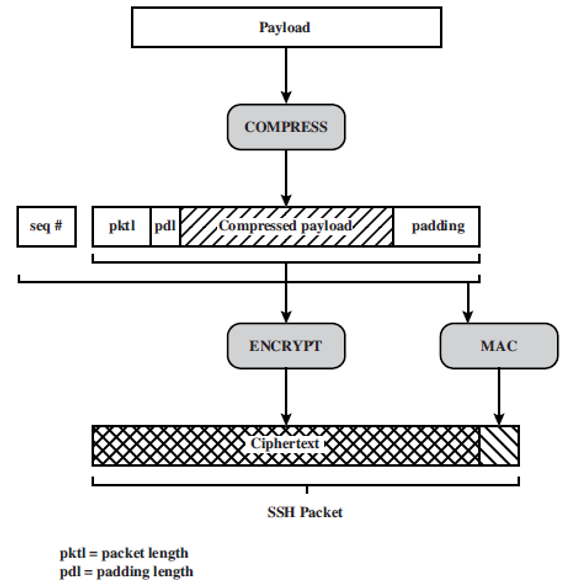
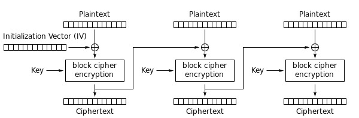

# SSH-TLP-Packet-Formation
### Introduction

This scenario should help students to understand how packet exchange by using SSH protocol actually works.

SSH Transport Layer Protocol Packet Formation [1](#fn1)

The scenario is a console application that provides the string preparation for safe sending via a computer network in a manner similar to the way in which packet is formed in the _SSH Transport Layer Protocol_ step by step. _Compression_ and _seq#_ (schema [1](#fn1)) are not implemented. The program is a string of arbitrary lengths that are being prepared for sending, and keys for encryption KE and KMAC for integrity protection. The pre-encoding string must be formatted by concatenating the following fields (see schema [2](#fn2)):

*   **pktl** \- packet length in bytes, without pktl and MAC fields (_4 bytes_)
*   **pdl** \- the length of the padding, adding that the total length of the given string would be an integer of the block size required by the block encoder (_1 byte_)
*   **payload** \- set text ( _\> 1 byte_)
*   **padding** \- add-on at the end of the given text so that the total length of the given string is an integer of the block size that requires a block encoder ( _< 8 bytes_)

The formatted string is encrypted by using the **DES algorithm** in **CBC** mode. IV is generated as a random number. Formation of MAC by using HMAC-SHA1. CBC (_Cipher Block Chaining_) mode (schema below) is implemented directly in code step by step, without using any additional functions.

Cipher Block Chaining (CBC) mode encryption [2](#fn2)

The student can see how the implementation of the CBC mode should look in practice, which helps him to understand how this type of encoding actually works.

1\. \[William Stallings. _CRYPTOGRAPHY AND NETWORK SECURITY PRINCIPLES AND PRACTICE_. 5th ed. Prentice Hall, 2011.\][↩](#ref1) 
2\. [\[https://de.wikipedia.org/wiki/Datei:CBC_decryption.svg\]](https://de.wikipedia.org/wiki/Datei:CBC_decryption.svg)[↩](#ref2)
